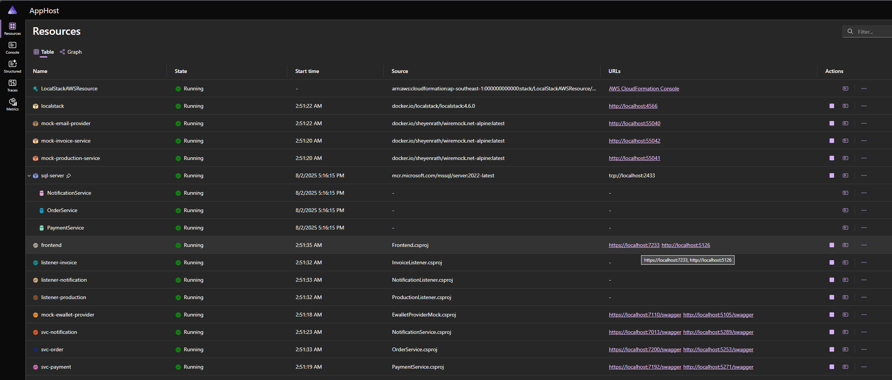
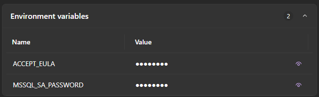

# ECommerce Demo Solution

This repository contains a demo e-commerce solution developed as part of an interview test.

## Scenario

Clients can search for their orders, checkout (pay for) them, and trigger downstream processes:
- If payment is **successful**:
  - The order is pushed to the internal Production system.
  - The client receives a confirmation email.
  - An invoice is generated in the Invoice system.
- If payment **fails**:
  - The client is notified of the failure.
  - No production or invoice actions are taken.

All external dependencies (Payment Service Provider, Email Service, Production Service, Invoice Service) are mockable for testing both success and failure cases.

## Features

- Search/filter orders by name
- Checkout and payment simulation (success/failure)
- Email notification simulation on successful payment
- Invoice creation simulation on successful payment
- Production system integration simulation
- Mocked external services for testing

## Technologies Used

- Microservices
- .NET / ASP.NET Core
- Entity Framework Core
- SQL Server
- AWS SQS
- Polly + Circuit Breaker
- Serilog
- Blazor
- Aspire + Docker (for local development)
- WireMock (for service mocking)

## Getting Started

1. Clone the repository:
    ```bash
    git clone https://github.com/imkenpachi/Interview.Tests.git
    ```
2. Open the solution with Visual Studio 2022

3. Start the project with Aspire AppHost (default profile). Running Docker engine is required.

4. When all projects are running, open URL of *FrontEnd* for verifying features




5. Connect to MS SQL server from port 2433 for verifying stored data. The credentials can be found in Environment Variables of SQL server container.



## System design document

[Link to system design document](docs/SystemDesign.md)

## Time Tracking

Total time spent: 24 hours
- 2025-07-30: 20:00 - 00:00 (4 hours): Brainstorm
- 2025-07-31: 20:00 - 00:00 (4 hours): Design workflows, tech stack, draft the solution
- 2025-08-01: 20:00 - 00:00 (4 hours): Develop common modules
- 2025-08-02: 09:00 - 21:00 (12 hours): Develop services and documentation

## Disclaimer
**This project is for demonstration purposes only and is not production ready.  
It is intended to showcase design and implementation skills for an interview test.  
Do not use this code as-is in any production environment.**

## License

This project is licensed under the MIT License.