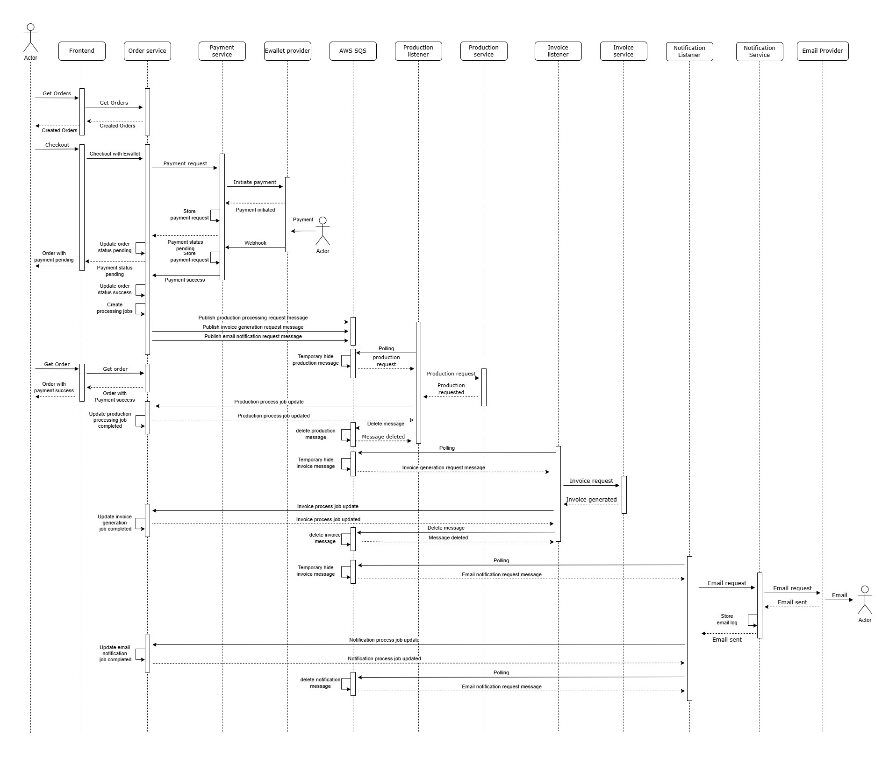

# System Design: ECommerce Demo Solution

## 1. Overview

This document describes the architecture and design decisions for the ECommerce demo solution, built to fulfill the interview scenario requirements.

## 2. Functional Requirements

- **Order Search**: Users can search/filter orders by name.
- **Checkout & Payment**: Users can checkout orders; payment can succeed or fail (mocked).
- **Production Integration**: On successful payment, order is pushed to the Production system (mocked).
- **Email Notification**: On successful payment, a confirmation email is sent (mocked).
- **Invoice Generation**: On successful payment, an invoice is created in the Invoice system (mocked).

## 3. Architecture

### Components

- **Frontend**: UI for searching, viewing, and checking out orders.
- **Order Service**: Handles order management, search, checkout logic, create events
- **Payment Service**: Payment gateway.
- **Notification Service**: Sends email notifications.
- **Ewallet Provider Mock**: Simulate payment process (success/failure)
- **Invoice Listener**: Listens for successful payment events and triggers invoice creation.
- **Production Listener**: Listens for successful payment events and triggers production processing.
- **Notification Listener**: Listens for successful/failure payment events and triggers email notification.
- **Aspire**: Local development orchestrator for dependencies and mocks.

### Component Interaction Diagram

```
            [Frontend] --> [OrderService] <--> [PaymentService] <--> [EwalletProvider]
                                 |                                       (mocked)
                                 v
                        [Order Process Queue]
                                 |
        +------------------------+--------------------------+
        |                        |                          |
[ProductionListener]     [InvoiceListener]        [NotificationListener]
        |                        |                          |
[ProductionService]      [InvoiceService]         [NotificationService]
    (mocked)                 (mocked)                       |
                                                     [EmailProvider]
                                                        (mocked)
```

### Sequence diagram

#### Payment success scenario



#### Payment failure scenario


## 4. Database Schema

### Order service


### Payment service


### Notification service


## 5. HTTP Endpoints

### Order Service

#### User-facing endpoints

- `GET /api/v1/users/{userId}/orders?name={search}&page={pageNumber}&pageSize={pageSize}` — Search orders by name with pagination support

- `POST /api/v1/users/{userId}/orders/{orderId}/checkout` — Checkout an order

#### Internal endpoints

- `GET /api/internal/v1/users/{userId}/orders/{orderId}` — Get order information

- `POST /api/internal/v1/users/{userId}/orders/{orderId}/confirm-payment` — Update payment status for an ordern

- `POST /api/internal/v1/orderprocesses/{processId}/status` — Update status for a process job

### Notification Service

#### Internal endpoints

- `POST /api/internal/v1/users/{userId}/emails/send` — Send email notification request to email provider

### Payment Service

#### Internet facing endpoints

- `POST /api/v1/payments/webhook` — Webhook endpoint to receive payment status update from payment provider

#### Internal endpoints

- `POST /api/internal/v1/users/{userId}/payments` — Send payment request to payment provider

### Invoice Service (mocked)

#### Internal endpoints

- `POST /api/internal/v1/invoices` — Generate invoice

### Production Service (mocked)

#### Internal endpoints

- `POST /api/internal/v1/productions` — Push order to production

### Ewallet Provider (mocked)

#### Internet facing endpoints

- `POST /api/payment/payment-requests` — Request a payment, automatically trigger a POST request to webhook after some random delay (from 3s to 10s) - Simulate a payment action

## 6. Assumptions

- All external services can be mocked for local development.
- Payment, email, invoice, and production actions are asynchronous and decoupled via background listeners.
- Users, providers are authenticated (authentication is out of scope for this demo).
- Webhook requests are signed and verified (signature verification is out of scope for this demo).

## 7. Validation

- Mock services can be configured to simulate both success and failure. The payment with amount of .99 cents will be simulated as a success payment and the payment with amount of .11 cents will be simulated as a failed payment.
- End-to-end flows can be tested locally using Aspire AppHost, Docker, [LocalStack](https://github.com/localstack/localstack) and [WireMock](https://wiremock.org/).
- Demonstrated result can be reviewed and validated by viewing data in the database and UI.

## 8. Delivery Plan

- Unit tests
- Build CI/CD pipelines to streamline software delivery.
- Provison required resources in target cloud platform by IaC to keep consistency across all environments.
- Ensure all functional requirements are implemented and tested using mocked services.
- Validate the solution by demonstrating end-to-end flows in the UI and database.
- Performance, Penetration, Regression, Automation tests
- Blue-green deployment to reduce the risk of downtime during deployments
- The deployment for each service should be horizontally auto scaled based on predefined metrics, specially, message queue's metrics for listener services.

## 9. Codebase Structure & Modularity

### Folder Structure

```bash
├── {Domain}Service
│   ├── Configuration
│   ├── Controllers
│   │   ├── Internal
│   │   │   ├── v1
│   │   ├── v1
│   ├── Exceptions
│   ├── ExternalServices
│   ├── Infrastructure
│   │   ├── Database
│   │   │   ├── Migrations
│   ├── Models
│   │   ├── v1
│   │   │   ├── Common
│   │   │   ├── DomainModels
│   │   │   ├── DTOs
│   │   │   │   ├── External
│   │   │   ├── Enums
│   ├── Repositories
│   ├── Dockerfile
│   ├── Program.cs
```
- **Each service** is self-contained, with its own domain, infrastructure, application logic, and tests.
- **Shared** module contains reusable libraries, DTOs, and API contracts to ensure consistency and reduce duplication.
- **docs** contains design documents and diagrams.

## 10. Further thoughts

- Microservices architecture, which is scalable and maintainable for a large team. Each domain (Order, Payment, Notification, etc.) is a separate service, enabling team ownership and independent deployment.

- Using process/jobs tracking tables for tracking async operations helps ensure consistency. This can be extended to the SAGA design pattern, which helps manage long-running and distributed transactions, bringing benefits to data integrity management.

- Microservices architecture, which allows services to be scaled effectively and independently, making the whole solution resilient and highly available for industry-scale traffic.

- Async processing with the use of queues and listeners for heavy/slow operations (email, invoice, production) keeps the system responsive.

- Use of Polly for resilience and transient fault handling.

- Indexes on search/filter fields (e.g. user ID, order name) for fast queries. We can enable Full-Text Search in SQL Server for advanced querying.

- With structured logging and event correlation, we can quickly pinpoint issues and perform analytics.

---

**For further details, see the code and comments in each service directory.**